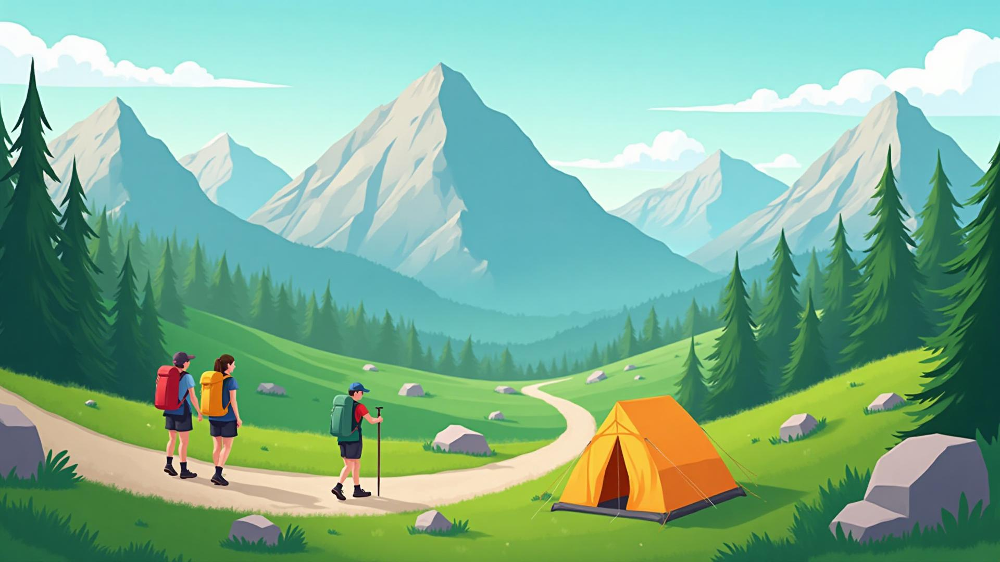

# Hiker App – Hiking Landing Page

Modern, high‑performance React + Vite landing page for a hiking app. Built with Tailwind CSS and Framer Motion, featuring animated sections, modal authentication, and responsive UI.

## Preview


## Tech Stack
- React 18, Vite 5
- TypeScript
- Tailwind CSS (+ tailwind-merge, typography)
- Framer Motion (page/section animations)
- React Router v6 (routing & 404)
- Lucide Icons
- TanStack Query (ready for data fetching)

## Features
- Smooth hero with background image and store CTAs
- Trails, Features, Community, About, Contact sections
- Framer Motion animations (route transitions and in‑view effects)
- Login / Sign Up modals with social buttons (Google, Facebook, GitHub)
- 404 page aligned with site design
- Mobile‑first responsive layout and smooth anchor scrolling

## Getting Started
```bash
# 1) Install deps
npm install

# 2) Start dev server
npm run dev

# 3) Build for production
npm run build
# Preview production build
npm run preview
```

## Project Structure
```
src/
  components/
    Header.tsx              # Navbar + login/signup modals
    HeroSection.tsx         # Hero with bg image & CTAs
    TrailSection.tsx        # Trails grid
    FeaturesSection.tsx     # App features
    CommunitySection.tsx    # Recent adventures & sidebar
    AboutSection.tsx        # About Hiker
    ContactSection.tsx      # Contact form
    auth/
      LoginModal.tsx
      SignUpModal.tsx
  pages/
    Index.tsx               # Home composition
    NotFound.tsx            # 404
  main.tsx, App.tsx         # App boot & animated routes
  index.css                 # Theme tokens and utilities
```

## Key Decisions
- Removed shadcn/ui components; replaced with semantic HTML + Tailwind utilities.
- Centralized animations with Framer Motion (route transitions + section reveals).
- Modal auth extracted to reusable components (`components/auth/*`).
- Smooth anchor scroll enabled via `html { scroll-behavior: smooth; }`.

## Customization
- Colors and shadows live in `src/index.css` under `@layer base :root`.
- Swap hero background by replacing `src/assets/hero-hiking.jpg`.
- Tune animation timings in components (search for `motion` usage).

## Environment & Deployment
- No server required; static export works on any static host (Vercel/Netlify).
- Ensure `base` in `vite.config.ts` matches your deploy path if deploying to a subfolder.

## Accessibility
- Keyboard‑focusable buttons/links, sufficient contrast.
- Modals close on overlay click; can be extended with ESC/focus‑trap.

## Scripts
- `npm run dev` – start dev server
- `npm run build` – build production assets
- `npm run preview` – preview production
- `npm run lint` – run ESLint

## Roadmap Ideas
- Hook real OAuth providers to social buttons
- Persist auth state and gated content
- Add dark mode toggle
- Add content CMS for trails/posts

## License
MIT
